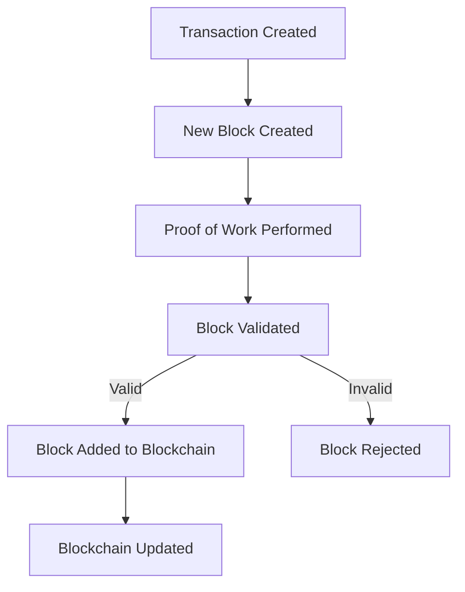

# JavaScript Blockchain Implementation

This project is a simple implementation of a **blockchain** written in **JavaScript**. It demonstrates core blockchain 
concepts such as blocks, transactions, proof-of-work and validation.

## Features

- **Blockchain Structure**: Implements a chain of blocks containing transaction data. (**TODO**)
- **Proof of Work**: Uses a basic algorithm to secure the network. (**TODO**)
- **Transactions**: Supports adding and validating transactions. (**TODO**)
- **Block Validation**: Ensures blocks are linked securely using cryptographic hashes. (**TODO**)
- **Mining Rewards**: Simulates mining rewards for creating new blocks. (**TODO**)

## Prerequisites

Make sure you have the following installed:

- **Node.js** (version 14 or higher)

## Installation

Clone the repository:

```bash
git clone https://github.com/jcasanella/blockchain.git
cd blockchain
```

## Usage (TODO)

Run the blockchain script:

```bash
node index.js
```

To interact with the blockchain, add transactions and mine blocks.

## Project Structure

- **block.js**: Defines the structure of a block. (**TODO**)
- **blockchain.js**: Implements the blockchain and its methods. (**TODO**)
- **transaction.js**: Handles transactions between users. (**TODO**)
- **index.js**: Entry point for running and interacting with the blockchain. (**TODO**)

## Concepts Demonstrated

1. **Block Structure**  
Each block contains:

   - Timestamp
   - Transaction data
   - Hash of the block
   - Hash of the previous block


   
2. **Proof of Work**  
Implements a basic mining process to solve a computational problem.

3. **Cryptographic Hashing**  
Uses SHA-256 to secure block contents.

4. **Decentralization Simulation**  
Enables adding transactions and mining blocks to simulate a decentralized ledger.

## Contributing

Contributions are welcome! Feel free to fork the repository, make changes, and submit a pull request.

## Acknowledgments

Inspired by various blockchain tutorials and resources.  
Thanks to the open-source community for their support.